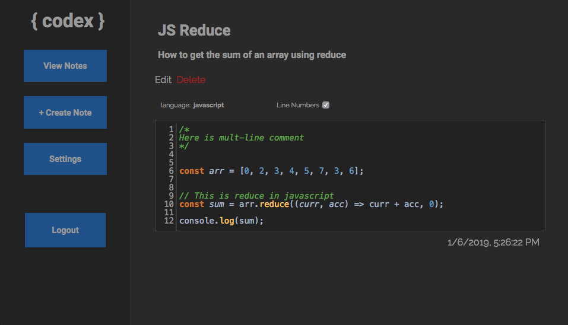

<h1 align="center">{ codex }</h1>

 <h3 align="center" style="font-size: 15px">a rolodex for code snippets and notes</h3>

    <a href="https://codex-notes.herokuapp.com">Visit the live deployment here</a>

 

## ABOUT

#### Features
- Free account creation
    - All passwords are hashed
    - Login persists on page refresh
    - Ability to change password
- Built in code editor
    - Supports many languages
    - Syntax highlighting
    - Highlights matching brackets
    - Auto-close brackets
    - Line numbers that can be toggled
- Themes
    - Currently supports a light and dark theme
    - Theme is saved upon login/logout
- Search
    - Filter notes by title 
    - Matches multiple partial words searches

#### Tech stack
- Built with the MERN stack.
- Unit and integration tests with Jest
- Continuous Integration/Deployment with Travis CI and Heroku
- Code editor powered by CodeMirror
- Passwords are hashed using `bcrypt`
- Authentication using JWT's

#### Roadmap
- Vim keymap option
- Tags field for notes
- Color field for notes
- Improved search features
- Login/signup through github
- Synchronize notes with github gists

## DEVELOPMENT
PR's welcome!

### Setup

1. Fork/clone repo to a location of your choice

1. Run `npm install` in root folder

1. `cd` into the `client` folder and run `npm install`

### API Reference

API root url: `https://codex-notes.herokuapp.com/api`

#### `/login`
- [POST] Login user
    - `username` and `password` required

#### `/signup`
- [POST] Create new user
    - `username` and `password` required

#### `/user`
- [GET] Get user data
    - Requires valid JWT

#### `/user/change-password`
- [PUT] change a users password
    - requires a valid jwt
    - a new password sent in the request body's `password` field is required

#### `/user/change-theme`
- [PUT] change a users password
    - requires a valid jwt
    - a new theme sent in the request body's `theme` field is required

#### `/notes`
- [POST] Save new note
    - `title`, `content` and `createdBy` required
    - `createdBy` is the ID of the user on the database (stored in `App`'s state
    - `description` is optional
    - Requires valid jwt

#### `/notes/:id`
- [GET] Get note by ID
    - Requires valid JWT
- [PUT] Update note by ID
    - Requires valid JWT
- [DELETE] Delete note by ID
    - Requires valid JWT
